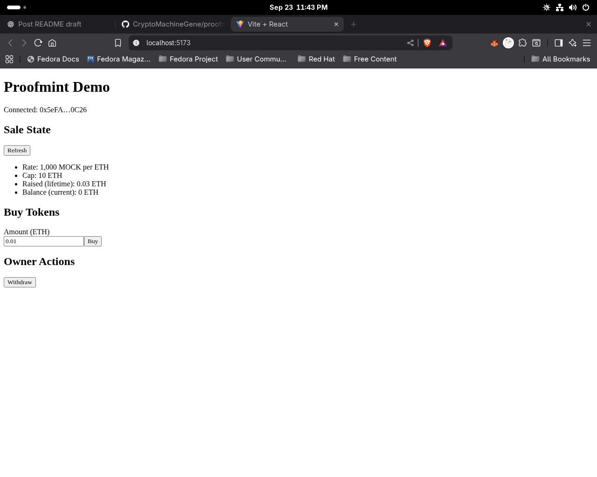
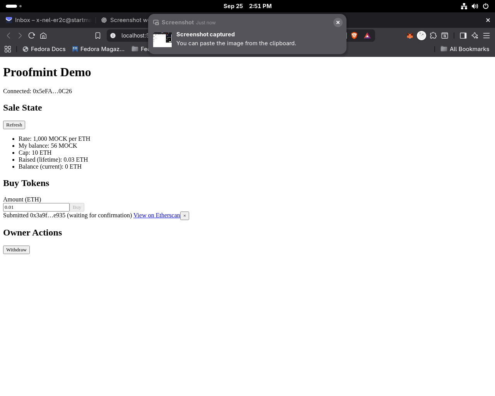
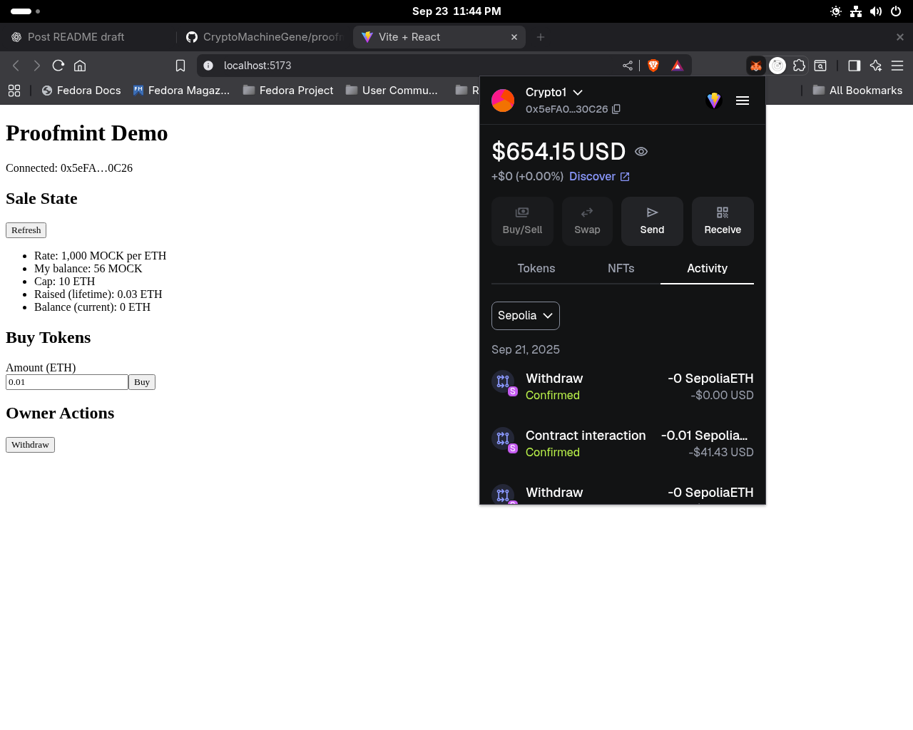
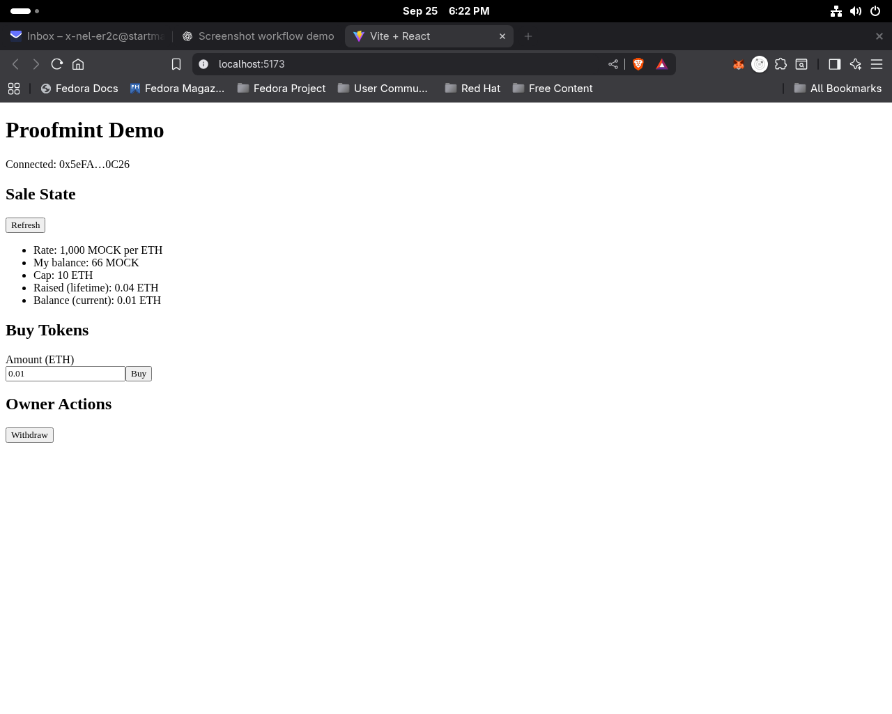
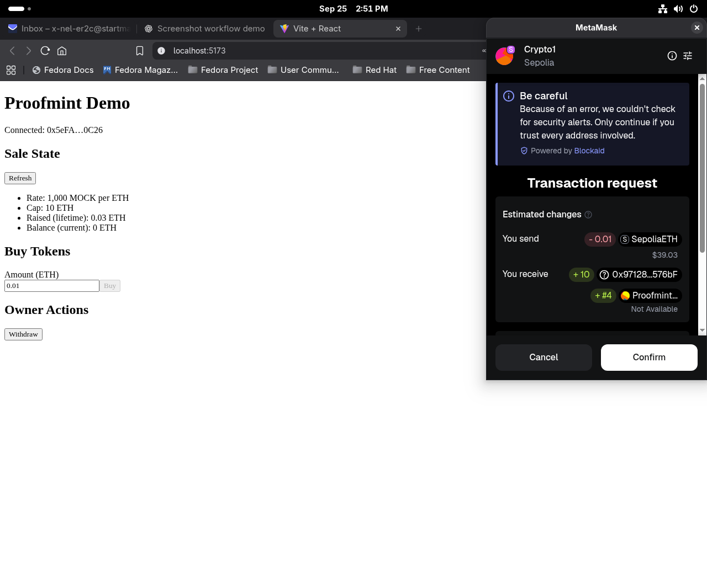
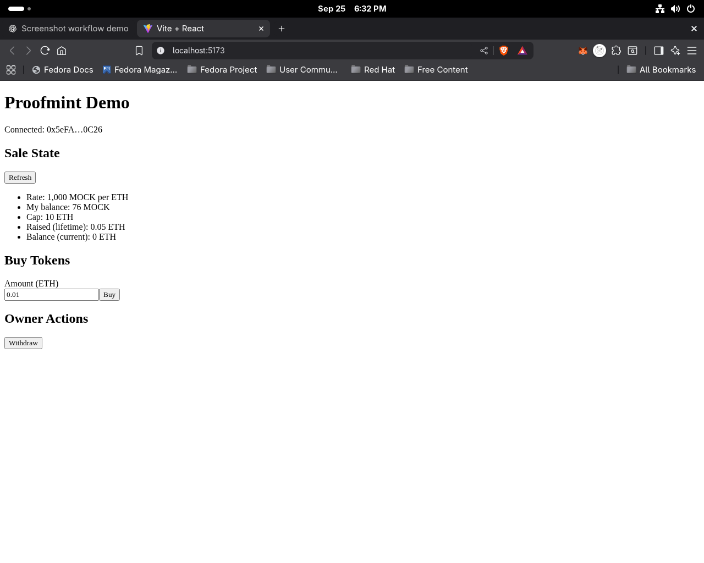

# Proofmint Project


## Contracts & Links

**Network:** Sepolia (Chain ID: 11155111)

- **Crowdsale:** [`0xEcB940c13A1EF6D411f2D7E15345591eb9fce1d7`](https://sepolia.etherscan.io/address/0xEcB940c13A1EF6D411f2D7E15345591eb9fce1d7)
- **Token (ERC-20):** [`0x9712820E18e5f2B8cBe3da25f31b8f2F8c8576bF`](https://sepolia.etherscan.io/address/0x9712820E18e5f2B8cBe3da25f31b8f2F8c8576bF)
- **ProofNFT (ERC-721, optional):** [`0xd3982fF82F27c790176138BC7115C6e32AFb0ED3`](https://sepolia.etherscan.io/address/0xd3982fF82F27c790176138BC7115C6e32AFb0ED3)

**Latest Transaction:** [`0x9905c061…`](https://sepolia.etherscan.io/tx/0x9905c061baaf0457115d77b2d47555c15317bc40383ff94725d6c804a283c2c7)

---

## 📸 Demo Screenshots
Explore the full walkthrough of the Proofmint demo:  
[View the Screenshot Gallery](assets/SCREENSHOTS.md)

A full-stack dApp featuring a token crowdsale with optional NFT receipts.  
Built as part of the **Dapp University Blockchain Developer Mentorship (Capstone Project)**.

---

## Project Status
- ✅ Contracts deployed & verified on Sepolia
- ✅ Frontend scaffolded (wallet connect, state panel)
- ✅ README & DEV_NOTES polish
- ⏳ Final UI polish (screenshots, tiny UX nits)
- ⏳ Demo video recording
- ⏳ Portfolio site card + live demo link

---

## Overview
- **Backend (Hardhat + Foundry)**  
  - ERC20 Token  
  - Crowdsale contract  
  - Optional ProofNFT (NFT receipts for buyers)  

- **Frontend (React + Vite + Tailwind)**  
  - Connect wallet (MetaMask, Sepolia)  
  - View live crowdsale stats  
  - Purchase tokens with ETH  
  - (Future) Display ProofNFT receipts  

---

## 🚀 Demo Flow
1. Connect wallet (MetaMask, Sepolia testnet)  
2. Enter ETH amount and buy tokens  
3. Receive tokens + auto-mint ProofNFT receipt (if enabled)  
4. Refresh sale state to view updated stats  
5. Withdraw balance (owner only)  

---

## Guided Walkthrough

1. Connect wallet → accept network switch to Sepolia.
2. Enter ETH amount (default `0.01`) and **Buy**.
3. Confirm in MetaMask → watch toast go Pending → Confirmed.
4. Click toast → verify on **Etherscan**.
5. State Panel updates Raised/Balance.
6. Owner: run **Withdraw** → balance resets to 0.
7. Hard refresh → state persists from chain.

---

## Files & Layout

- `assets/SCREENSHOTS.md` → full demo gallery  
- `proofmint-frontend/` → React + Tailwind front-end  
- `proofmint/` → Hardhat + Foundry contracts + scripts  
- `deployments/sepolia.json` → addresses & metadata  
- `deployments/txlog.json` → recent tx log

---

## Features
- Crowdsale contract where users can buy tokens with ETH  
- Live stats (rate, cap, raised, balance) displayed in the frontend  
- ERC20 token integration  
- Optional ProofNFT receipts for token buyers  

---

## Tech Stack
- **Smart Contracts**: Solidity, Hardhat, Foundry, TypeScript, Ethers.js  
- **Frontend**: React, Vite, Tailwind CSS  
- **Network**: Sepolia testnet  

---

## Testing
The contracts are tested with both **Hardhat** and **Foundry** to showcase flexibility in tooling.  
- **Hardhat** provides the main TypeScript-based workflow for compilation, deployment, and verification.  
- **Foundry** adds fast Solidity-native tests (`forge test -vv`) for critical flows like token minting, crowdsale purchases, and reverts.  

Together, these frameworks ensure the system is covered end-to-end while demonstrating cross-toolchain proficiency.

---

## Setup
To run Proofmint locally, clone the repo and install dependencies for both the backend (contracts) and the frontend (React app).  
You’ll need **Node.js (>=18)**, **npm**, and a Sepolia testnet wallet funded with ETH for testing purchases.  
The frontend also requires a `.env.local` file with deployed contract addresses and RPC configuration.

---

### Backend
```bash
cd proofmint
npm install
npx hardhat compile
npx hardhat test
forge test -vv
```

## Deploy to Sepolia (example)
# adjust path if your deploy script differs
```bash
npx hardhat run scripts/deploy/03_deploy_crowdsale.ts --network sepolia
```

---

## How to Run (Frontend)
```bash
cd proofmint-frontend
npm install
npm run dev
```
Create a .env.local file in proofmint-frontend/ with the following values (replace with your deployed addresses):
```bash
VITE_CHAIN_ID=11155111
VITE_CHAIN_ID_HEX=0xaa36a7

# Deployed contract addresses (Sepolia)
VITE_TOKEN_ADDR=0x...
VITE_NFT_ADDR=0x...
VITE_CROWDSALE_ADDR=0x...

# RPC (for reads if wallet is disconnected)
VITE_FALLBACK_RPC=https://eth-sepolia.g.alchemy.com/v2/your-key
```

---

## Known Gotchas
Sepolia only. The dApp is coded for chain ID 11155111 (0xaa36a7). On other chains, UI is disabled and a “Switch to Sepolia” prompt appears.

.env.local required. Missing or incorrect VITE_CROWDSALE_ADDR or VITE_FALLBACK_RPC can cause a blank screen or read-only state.

Read-only until wallet connects. The app uses a fallback RPC for initial reads; connect your wallet for live updates + write actions.

Owner-only Withdraw. The Withdraw button is hidden unless your connected wallet matches the Crowdsale owner(). This is enforced in both UI and contract.

State timing. After buys/withdraws, on-chain state can take a moment to index. The UI shows toasts + an Etherscan link and then refreshes state.

More docs: See proofmint-frontend/DEV_NOTES.md
 for current Sepolia addresses and the step-by-step UI test flow.

 ---

## Contracts (Sepolia)

For full contract addresses, see [Contracts & Links](#contracts--links) at the top.

<details><summary>Recent Activity (last 3 txs)</summary>

- withdraw: [`0xf760fede…`](https://sepolia.etherscan.io/tx/0xf760feded56bd78961a6c4d84364005fd48729378079ff0690641abab2f497b4)  _(2025-09-26)_
- purchase: [`0x9905c061…`](https://sepolia.etherscan.io/tx/0x9905c061baaf0457115d77b2d47555c15317bc40383ff94725d6c804a283c2c7)  _(2025-09-26)_
- misc: [`0xe2d368a7…`](https://sepolia.etherscan.io/tx/0xe2d368a74fa945cca1ecddc320a6e5376797698c674011a03a9012d66301d7e8)  _(2025-09-26)_

</details>

<!-- CONTRACTS:END -->

---

## Screenshots
| Step | Image |
|---|---|
| Connect (pre) |  |
| Buy form |  |
| Pending |  |
| Confirmed |  |
| State updated |  |
| Withdraw (owner) |  |
| Balance reset |  |

---

**License:** MIT  
**Last updated:** September 29, 2025  
**Capstone:** Dapp University Blockchain Developer Mentorship
