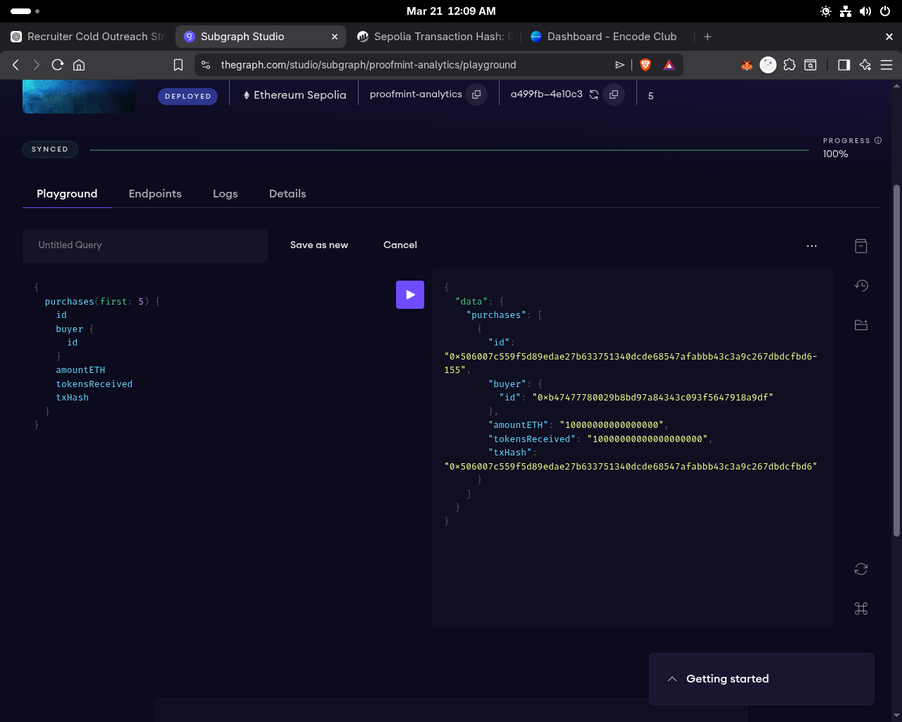
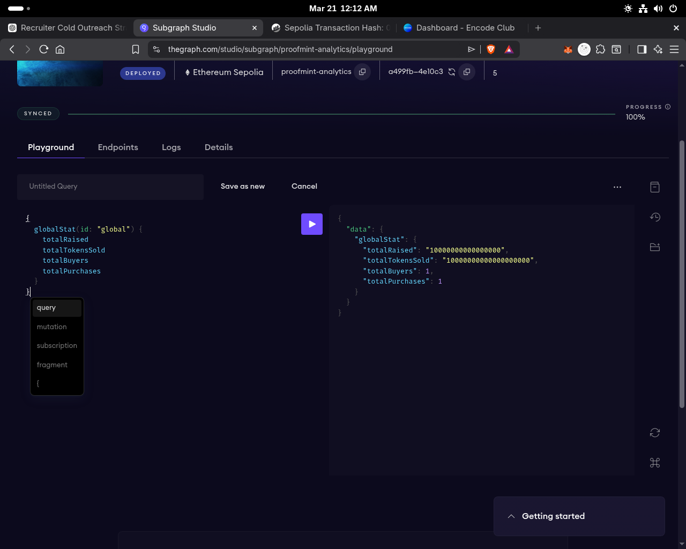

# Proofmint Project

End-to-end Web3 system with real-time on-chain analytics.


Full-stack Web3 dApp with an ERC-20 crowdsale, optional ERC-721 NFT receipts, and a real-time analytics pipeline powered by The Graph.

Includes a full analytics layer powered by The Graph for transforming raw blockchain events into structured, queryable data.

Demonstrates end-to-end blockchain system design: smart contracts → frontend → indexed on-chain data → queryable insights.

Built as part of the Dapp University Blockchain Developer Mentorship (Capstone Project).

---

## ⚡ TL;DR

• ERC-20 crowdsale with optional ERC-721 receipt NFTs  
• Fully deployed on Sepolia testnet  
• Real-time indexing using The Graph (subgraph + GraphQL)  
• React + Tailwind frontend with wallet interaction  
• End-to-end system: contract → events → indexing → UI  

This project focuses on system design and data flow, not just contract deployment.

---

### Why it matters

Raw blockchain logs are difficult to work with in real applications.

This project demonstrates how to transform on-chain events into structured, queryable data for real-world use cases:

- Real-time analytics  
- Wallet behavior tracking  
- Dashboard-ready insights  
- Queryable Web3 data via GraphQL  

**Pipeline:**  
Smart Contract → Events → Subgraph → GraphQL → Analytics

---

## 🛠 System Architecture (What I Built)

• Smart contracts (ERC-20 token, crowdsale, ERC-721 receipt NFT)  
• Deployment + testing (Hardhat + Foundry)  
• Frontend (React + Tailwind, wallet integration)  
• Subgraph (The Graph indexing + GraphQL queries)  
• Full pipeline: contract events → indexed data → frontend display  


---

## 🚀 Proofmint Live Links

✅ **Live dApp (Sepolia):**  
https://cryptomachinegene.github.io/proofmint-project/

📦 **Source Code Repo:**  
https://github.com/CryptoMachineGene/proofmint-project

🎥 **Demo Walkthrough (YouTube):**  
https://www.youtube.com/watch?v=CatHeV8tclI

Proofmint is an ERC-20 crowdsale with ERC-721 NFT contribution receipts, built and tested with Hardhat + Foundry.

---

## 🔗 Contracts & Links (Sepolia)

**Network:** Sepolia (Chain ID: 11155111)

- **Crowdsale:** [`0xEcB940c13A1EF6D411f2D7E15345591eb9fce1d7`](https://sepolia.etherscan.io/address/0xEcB940c13A1EF6D411f2D7E15345591eb9fce1d7)
- **Token (ERC-20):** [`0x9712820E18e5f2B8cBe3da25f31b8f2F8c8576bF`](https://sepolia.etherscan.io/address/0x9712820E18e5f2B8cBe3da25f31b8f2F8c8576bF)
- **ProofNFT (ERC-721, optional):** [`0xd3982fF82F27c790176138BC7115C6e32AFb0ED3`](https://sepolia.etherscan.io/address/0xd3982fF82F27c790176138BC7115C6e32AFb0ED3)

- **Latest example tx:** [`0x09097d8066…`](https://sepolia.etherscan.io/tx/0x09097d80660c4a6ec44a0d922816c8a455430b29f3bdfb3efa2f07cec8202dc5)  
- **Screenshots gallery:** [assets/SCREENSHOTS.md](assets/SCREENSHOTS.md)  
- **Tx Log:** [deployments/txlog.json](proofmint/deployments/txlog.json)

---

## 🚀 Demo Walkthrough (Sepolia)

Live dApp: https://cryptomachinegene.github.io/proofmint-project/

Flow: connect → buy → verify on Etherscan → owner withdraw.
(UI is intentionally minimal — focus is on smart contract architecture, testing, and deployment.)

Analytics flow: contract events → subgraph indexing → GraphQL queries → structured insights.

Includes subgraph-powered GraphQL queries for indexed analytics.

### 3-minute flow
1. Open the dApp (read-only state shows via `FALLBACK_RPC`).  
2. Connect wallet → allow/switch to **Sepolia** if prompted.  
3. Buy `0.01` ETH → pending → confirmed → open Etherscan.  
4. (Owner) Withdraw → state reflects updated balances.  
5. Disconnect + hard refresh → read-only state persists.

---

## 🧩 Overview

**Backend (Hardhat + Foundry)**
- ERC-20 Token
- Crowdsale contract
- Optional ProofNFT (receipt NFT)

**Frontend (React + Vite + Tailwind)**
- Wallet connect (MetaMask/Brave)
- Live crowdsale stats
- Buy with ETH (auto-detects payable path)
- Owner withdraw

---

## 📊 Subgraph & Analytics Layer

This project includes a full indexing and analytics pipeline using **The Graph**.

- Subgraph location: `proofmint-subgraph/`
- Indexes on-chain events from the Proofmint contracts
- Transforms raw blockchain logs into structured, queryable data

### What is indexed
- Purchase events (crowdsale participation)
- Token distribution data
- NFT receipt minting
- Wallet-level activity

### 📸 Subgraph Query Examples

#### Purchases (Event-Level Data)


#### Global Stats (Aggregated Analytics)


Captured from a live subgraph deployed on Sepolia, showing indexed on-chain data exposed via GraphQL queries.


---

## ⚙️ Setup
- **Prereqs:** `Node 18+`
- **Env:** copy `proofmint-frontend/.env.local.example` → `.env.local` and set `VITE_FALLBACK_RPC`. (optional)

### Backend
```bash
cd proofmint
npm install
npx hardhat compile
npx hardhat test
forge test -vv
```

### Deploy to Sepolia (example)
```bash
npx hardhat run scripts/deploy/03_deploy_crowdsale.ts --network sepolia
```

### Frontend
```bash
cd proofmint-frontend
npm install
npm run dev
npm run build && npm run preview
```

#### Create `proofmint-frontend/.env.local`
```ini
VITE_CHAIN_ID=11155111
VITE_CHAIN_ID_HEX=0xaa36a7
VITE_FALLBACK_RPC=<YOUR_PUBLIC_SEPOLIA_RPC_URL>

VITE_CROWDSALE_ADDRESS=0xEcB940c13A1EF6D411f2D7E15345591eb9fce1d7
VITE_TOKEN_ADDRESS=0x9712820E18e5f2B8cBe3da25f31b8f2F8c8576bF
VITE_NFT_ADDRESS=0xd3982fF82F27c790176138BC7115C6e32AFb0ED3
```

--- 

## 🧰 Troubleshooting

**White screen but Vite is running** → Ensure `index.html` has `<div id="root"></div>` and `src/main.tsx` uses `createRoot(...)`.

**“Missing VITE_*”** → Add keys to `.env.local` and restart `npm run dev`.

**Auto-reconnect on refresh** → remove `localhost:5173` from wallet **Connected sites**, or use a Private window for the “disconnected + read-only” state.

**Withdraw fails** → only the **owner** can call `withdraw()` (enforced by the contract).

---

## 🗺 Repo Layout
- `proofmint/` — Hardhat + Foundry smart contracts and deployment scripts  
- `proofmint-frontend/` — React + Tailwind front-end  
- `proofmint-subgraph/` — Subgraph indexing + GraphQL analytics layer  
- `assets/SCREENSHOTS.md` — full demo gallery  
- `deployments/sepolia.json` — addresses & metadata  
- `deployments/txlog.json` — recent tx log

---

## License
MIT

_Last updated: February 3, 2026 · Chain: Sepolia (11155111)_
