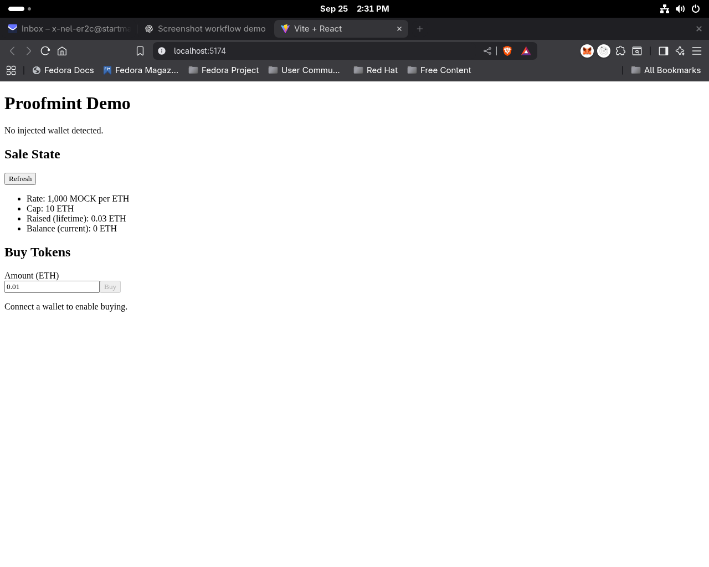

# Proofmint Demo — Screenshot Gallery

A guided tour of the live demo.

1.   
   *Proofmint dApp home — connect your wallet to begin.*
2.   
   *Connect with an injected wallet (Brave/MetaMask) or WalletConnect.*
3.   
   *Wallet prompts permission to use Sepolia (switch/enable if needed).*
4.   
   *Sale State shows rate, cap, raised total, and current balance.*
   - *Alt view:* 
5.   
   *Enter an ETH amount to purchase tokens via `buyWithAuto`.*
6.   
   *Transaction pending — watch for confirmation and Etherscan link.*
7.   
   *Purchase confirmed — open the receipt on Etherscan.*
8.   
   *Etherscan receipt — `To` = Crowdsale, Value 0.01 ETH.*
9.   
   *Owner-only Withdraw visible before action.*
10.   
    *After withdraw: funds forwarded; Balance = 0 ETH.*
11.   
    *State persists after disconnect + hard refresh via FALLBACK_RPC.*
